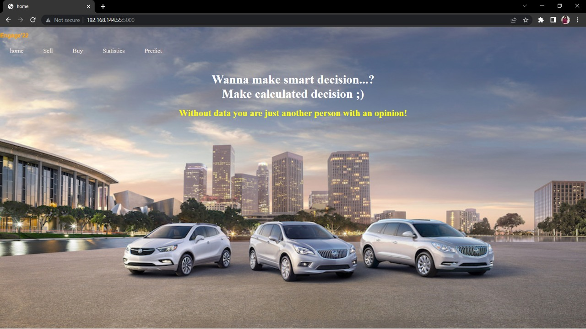

# Car Suggest and Price Predict Web Application
- Namaste, Everyone!
- I created this ML based car suggest and price predict application for MS ENGAGAE program 2022. The website is fully functional and useable in real life. This is easy to use. I used agile methodology for this project as mentioned as part of this program. I divided my whole task into four weeks. I started completing my tasks as sprint wise that helped in smooth learning and building the product.

## Features

- Suggest cars based on categorised specifications
- Predict negotiable price to sell or buy second hand car
- Compare engine specifications with other users
- Depict correlation statistics among car specification parameters

### Website Features Design and flow

# Website Layout
Homepage constitutes the basic features of applications mentioned in the navigation bar. The basic functioning of these features is:

## Buy Feature (Home >> Buy)
- Suggest best suited model based upon user fed specifications
- Model can be suggested based on budget as a priority parameter 
- Model can also be suggested through categories "Home >> Buy >> Categoty" with features namely:
1. Space
2. Power
3. Engine
4. Safety 
5. Comfort 
6. Miscellaneous

## Sell Feature (Home >> Sell)
- Predict negotiable price for used cars 
- Enter the required specification details of user vehicle
- Press 'Negotiate' button
- The prices generated are based upon 'EX-Showroom Prices' of vehicles

 # Buy through categories

# Predict Feature (Home >> Predict)
-Compares the engine specifications with users with similar specifications namely:
1. Mileage
2. Power
3. Torque
- Click on round icons to choose
- Enter expected specifications 
- Press 'Compare' button

# Statistics Feature (Home >> Statistics)
- Shows specs and statistics of correlation among various parameters 
- The specifications illustrated with respect to following specifications:
1. Engine
2. Chasis
3. Mileage

## Tech

Cars suggest and price predict web application uses a number of open source python libraries and styling tools:

- [Flask](https://palletsprojects.com/p/flask/) - Depolyed python project application
- [Pickle](https://docs.python.org/3/library/pickle.html) - Save and load ML models
- [Pandas](https://pandas.pydata.org/docs/reference/api/pandas.DataFrame.html) - Handling large dataframes
- [Numpy](https://numpy.org/) - Manipulating data to get data in alignment with requirements
- [Matplotlib](https://matplotlib.org/) - Plot effective visualisations
- [Plotly](https://plotly.com/) - Plot effective visualisations
- [Seaborn](https://seaborn.pydata.org/) - Plot effective visualisations
- [Stylesheet](https://cdnjs.cloudflare.com/ajax/libs/font-awesome/4.7.0/css/font-awesome.min.css) - Font style 
- [Script](https://maxcdn.bootstrapcdn.com/bootstrap/3.4.1/js/bootstrap.min.js) - Image styling 
- [Swiper](https://unpkg.com/swiper@8/swiper-bundle.min.css) - Swiper design and style script

# Application Development Strategy and Day to Day Task 
I divided my whole task into four week sprint program and proceeded, step by step from learning, building and deploying the project. Whatever I learned, explored, researched during this program is fully detailed in tables below:

# Video link of project with full explanation
Link : https://youtu.be/Nhd_aA6lrn8
